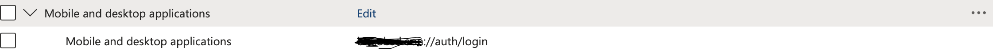

# MS Authenticate 🔐

A premium, native Flutter plugin for seamless Microsoft Azure Active Directory authentication. Built with performance, security, and user experience in mind.

[](https://pub.dev/packages/ms_authenticate)
[](https://pub.dev/packages/ms_authenticate)
[](https://opensource.org/licenses/MIT)

---

## ✨ Features

- **🚀 Truly Native**: Pure Kotlin and Swift implementation for maximum stability and performance.
- **🎨 Premium UX**: Uses **Chrome Custom Tabs** (Android) and **ASWebAuthenticationSession** (iOS) for a modern, integrated login experience that automatically closes after success.
- **⚡ Integrated Token Exchange**: Handles the entire OAuth 2.0 Authorization Code flow natively. No need for manual HTTP requests in your Flutter code.
- **🧵 Background Processing**: Token exchange is performed on background threads, ensuring a buttery-smooth UI.
- **🔒 Secure**: Built following modern security best practices for OAuth 2.0.

---

## 📸 Integrated Experience

The plugin uses high-end native components to provide an "in-app" browser feel, ensuring users never feel like they've left your application.

---

## 🛠 Getting Started

### 0. Prerequisites

**IMPORTANT**: For the native token exchange to work correctly on both platforms, you must register your custom URL scheme with Microsoft Entra ID (Azure AD).

1.  **Register an Application** in [Microsoft Entra ID](https://portal.azure.com).
2.  Go to **Authentication** > **Add a platform** > **Mobile and desktop applications**.
3.  Add a **Redirect URI**. This must match the `redirectUrl` you use in the code, typically in the format: `your.custom.scheme://auth/{your-default-path}`.
4.  Note your **Client ID (Application ID)**.



### 1. Installation

Add `ms_authenticate` to your `pubspec.yaml`:

```yaml
dependencies:
  ms_authenticate: ^0.0.1
```

### 2. Native Configuration

#### Android Setup
Add the intent filter to your `AndroidManifest.xml` to handle the redirect:

```xml
<intent-filter>
    <action android:name="android.intent.action.VIEW" />
    <category android:name="android.intent.category.DEFAULT" />
    <category android:name="android.intent.category.BROWSABLE" />
    <data android:scheme="your.custom.scheme" android:host="auth" android:path="{/your-default-path}" />
</intent-filter>
</application>
<queries>
        <intent>
            <action android:name="android.intent.action.PROCESS_TEXT"/>
            <data android:mimeType="text/plain"/>
        </intent>
</queries>
```

#### iOS Setup
(Implementation for iOS follows similar patterns using ASWebAuthenticationSession)

Add this to your Info.plist:

```xml
<key>CFBundleURLTypes</key>
<array>
    <dict>
        <key>CFBundleTypeRole</key>
        <string>Editor</string>
        <key>CFBundleURLSchemes</key>
        <array>
            <string>your-auth-schema</string>
        </array>
    </dict>
</array>
```

---

## 🚀 Usage

Authenticating with Microsoft is now just a single function call away:

```dart
import 'package:ms_authenticate/ms_authenticate.dart';

final _msAuth = MsAuthenticate();

Future<void> login() async {
  try {
    final tokenData = await _msAuth.loginWithMicrosoft(
      tenantId: 'your-tenant-id',
      clientId: 'your-client-id',
      redirectUrl: 'your.custom.scheme://auth/login',//default path : login
      scope: 'openid profile email offline_access',
    );

    if (tokenData != null) {
      final accessToken = tokenData['access_token'];
      print('Welcome! Access Token: $accessToken');
    }
  } catch (e) {
    print('Authentication failed: $e');
  }
}
```

---

## 📝 API Reference

| Method | Description |
| :--- | :--- |
| `loginWithMicrosoft(...)` | Initiates the login flow and returns the full token map (access_token, id_token, etc). |
| `getPlatformVersion()` | Utility to check the native platform version. |

---

## 🤝 Contributing

Contributions are what make the open source community such an amazing place to learn, inspire, and create. Any contributions you make are **greatly appreciated**.

---

## 📄 License

Distributed under the MIT License. See `LICENSE` for more information.

---

## 📧 Support

For support or custom development, please reach out to the project maintainers.

---

*Built with ❤️ for the Flutter Community.*
